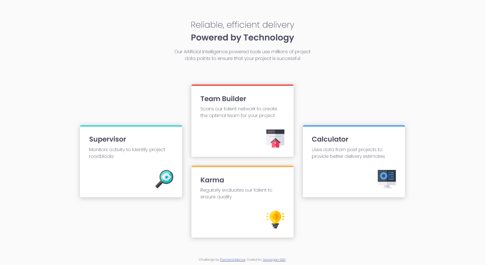

# Frontend Mentor - Four card feature section solution

This is a solution to the [Four card feature section challenge on Frontend Mentor](https://www.frontendmentor.io/challenges/four-card-feature-section-weK1eFYK).

### Screenshot

### Links

- Solution URL: [Frontend mentor](https://www.frontendmentor.io/solutions/four-card-feature-section-tSO2ljQw6U)
- Live Site URL: [Github pages](https://temesgen-982.github.io/four-card-feature-section/)

## My process

### Built with

- Semantic HTML5 markup
- CSS custom properties
- CSS Grid
- Mobile-first workflow

### Continued development

## Author

- Frontend Mentor - [@temesgen-982](https://www.frontendmentor.io/profile/temesgen-982)
